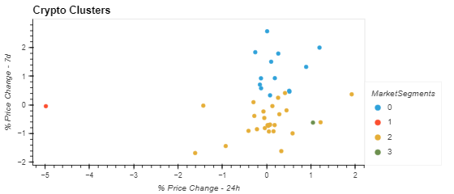

# Unsupervised_Learning_with_Crypto

This application analyses cryptocurrency pricing over multiple time periods using the K-means algorithm and Prinicpal Component Analysis (PCA).

---

## Technologies

This project leverages python 3.7 with the following packages:

**[Pandas Library Python](https://pandas.pydata.org/)** - a fast, powerful, flexible and easy to use open source data analysis and manipulation tool.<br>

**[pathlib Library Python](https://pathlib.readthedocs.io/en/pep428/)** - offers a set of classes featuring all the common operations on paths in an easy, object-oriented way.<br>

**[Matplotlib Python](https://matplotlib.org/)** - comprehensive library for creating static, animated, and interactive visualizations in Python.<br>

**[scikit-learn Python](https://scikit-learn.org/)** - simple and efficient tools for predictive data analysis.<br>

---

## Installation Guide

Before running the application first install the following dependencies:

1) Pandas Library is included with Anaconda so no need to install.<br>

2) pathlib is included with Anaconda so no need to install.<br>

3) Matplotlib is included with Anaconda so no need to install.<br>

4) scikit_learn Library is included with Anaconda so no need to install.<br>

The installation of libraries and dependencies is now complete.

---

## Usage

To use the application simply clone the repository and run the **crypto_investments.ipynb** file with:

```python
python crypto_investments.ipynb
```

For best results, it is recommended to open as a Jupyter Notebook.

Completed analysis will produce the below visualizations:

Composite Elbow Curve plots:


Composite Crypto Cluster Scatter plots:




---

## Contributors

**Contributor:** Lindsey Hardouin<br>
**Email Address:** lindseyhardouin@gmail.com<br>